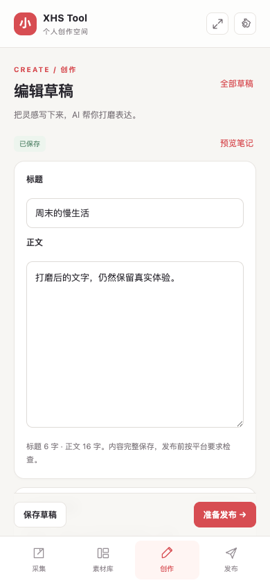
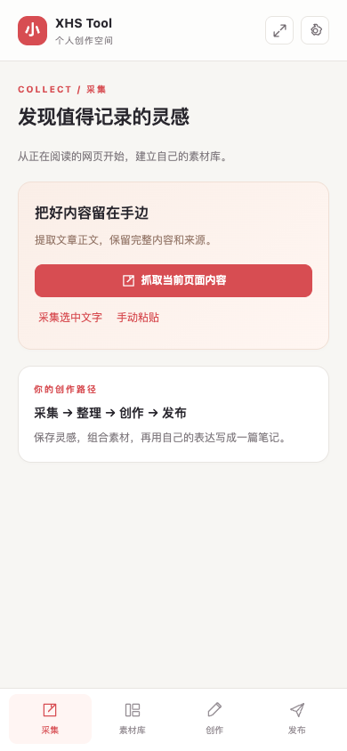

# XHS Tool

用于个人小红书内容创作的 Chrome 扩展：采集网页与选中文字、整理素材、AI 辅助写作、加密保存草稿、准备发布图文并手动记录数据。

<p align="center">
  <a href="docs/previews/editor.png">
    
  </a>
</p>

编辑标题与正文，查看保存状态，完成草稿后进入发布准备。点击截图可查看原图。

## 已实现

- 采集完整网页正文或手动粘贴；保存来源、标签、摘要，按内容去重。
- 文字/图片素材库，分页、标签筛选、客户端解密全文搜索、多素材生成提纲。
- 草稿读取与更新、自动保存、加密本机恢复、版本冲突保护；AI 结果先展示建议，再由用户采用或撤销。
- 私有图片签名预览、上传校验、配图选择与排序。
- 发布预览、复制图文、下载配图、打开创作中心、记录已发布链接、手动填写指标。
- 连接/账号检测，密码加密备份与事务合并恢复。

自动发布、Cookie 托管与自动采集指标尚未提供，相关接口明确返回 501。

<p align="center">
  <a href="docs/previews/collection.png">
    
  </a>
</p>

从当前网页、选中文字或手动粘贴开始，收集创作素材并保留来源。点击截图可查看原图。

## 本地启动

需要 Node.js/npm、Python 3.9+ 和 PostgreSQL 16。图片功能需要 Cloudflare R2；AI 功能需要 Anthropic 兼容接口。

```sh
npm ci
python3 -m venv backend/.venv
backend/.venv/bin/pip install -e './backend[dev]'
cp .env.example .env
```

编辑根目录 `.env`，填写数据库地址以及可选的 AI、R2 配置。后端从固定的项目根目录读取 `.env`，也可以用环境变量覆盖。

使用已有 PostgreSQL 时，创建 `xhs_tool` 数据库并配置相应连接账户；如需 Docker 提供数据库：

```sh
docker compose up -d postgres
```

**已有数据库先备份，再迁移。** 本次改动附带增量迁移，开发验证没有修改现有 `xhs_tool` 数据库。

```sh
# 使用与你的 DATABASE_URL 对应的连接参数；备份文件需妥善保存
pg_dump -h localhost -U xhs -d xhs_tool -Fc -f /tmp/xhs-tool-before-upgrade.dump
cd backend
.venv/bin/alembic upgrade head
.venv/bin/uvicorn app.main:app --reload --port 8000
```

另开终端，在项目根目录执行：

```sh
npm run build:extension
```

在 Chrome 的 `chrome://extensions` 开启开发者模式，选择“加载已解压的扩展程序”，打开 `extension/dist`。点击扩展图标打开侧边栏；右上角也可打开独立标签页。

设置页填写 `http://localhost:8000/api` 和原有 API Key，测试连接后保存。空数据库可初始化一次账号；已初始化的个人实例不允许重复匿名注册。API Key 只返回一次，请单独妥善保存。

## 数据与恢复

- PostgreSQL 保存加密素材/草稿以及来源、标签、发布链接等元数据；图片文件在 R2。
- 浏览器 `chrome.storage.local` 保存加密主密钥、连接设置和加密恢复草稿。恢复草稿按后端地址及 API Key 隔离。
- 新草稿使用加密格式 v2，标题与正文独立 IV；旧数据保持原样。旧版若已丢失正文 IV，迁移无法补回，界面明确提示恢复失败。
- 设置页可导出密码加密 JSON（PBKDF2 + AES-GCM）。包含数据库记录、浏览器加密密钥、本机恢复草稿；**不包含 R2 图片文件和 API Key**，请分别备份。密码至少 10 个字符。
- 恢复需要相同后端地址和原账号 API Key。会校验记录归属及关联，并保留已有服务器记录及本机编辑。浏览器已有不同主密钥时拒绝覆盖；请在新的浏览器配置中恢复。
- AI 操作会将当前所需明文发送到配置的 AI 服务，常规数据库持久化使用密文。

图片上传需要 R2 凭据、桶和 endpoint；`R2_PUBLIC_URL` 可不填，界面使用签名 URL。R2 桶的 CORS 必须允许扩展发起的 GET/PUT 请求和 Content-Type 头，否则界面会显示上传/下载失败。图片最大 20 MiB，支持 JPEG、PNG、WebP、GIF。

## 验证

```sh
npm test --workspace=extension
npm run build:extension
cd backend
DEBUG=false .venv/bin/python -m unittest discover -s tests -v
```

后端集成测试默认连接本机 `postgres` 维护数据库，在每个用例独立的随机 schema 中操作并清理，拒绝使用应用数据库 `xhs_tool`。可通过 `TEST_DATABASE_URL` 指定专用测试数据库。

浏览器测试用临时 Chrome 配置加载真正构建的扩展，拦截测试 API 和文章页面，不操作真实账号、AI 或 R2：

```sh
cd extension
npx playwright install chromium
npm run test:e2e
```

测试覆盖采集到素材库、草稿创建/重开/更新、AI 建议采用、发布记录、设置验证，以及加密/账户切换/网络失败/冲突和恢复场景。真实第三方服务与平台页面需使用自己的配置另行验证。

## 许可证

Copyright 2026 JasonH (yang0228).

本项目的自有代码采用 [Apache License 2.0](LICENSE) 许可，版权声明见 [NOTICE](NOTICE)。
允许商业使用、修改和分发，具体条件以许可证全文为准。
第三方依赖和组件仍遵循各自的许可证；本项目的许可不替代其原有版权和许可声明。
